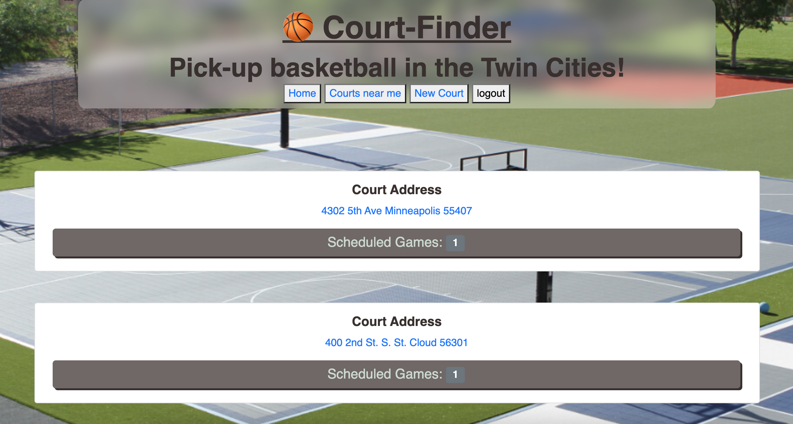

# court-finder
Our website allows users to create and join various pickup basketball games based on time and location. We deployed our site on heroku, and it utilizes Google API's for location information.

---

## **Table of Contents**

1. [Links](#Links)
2. [Technologies Used](#Technologies-Used)
3. [Contributors](#Contributors)

---

## **Links**

[Deployed application](https://quiet-beyond-45478.herokuapp.com/)\
[GitHub repository](https://github.com/boogiematrix/court-finder)

---
## **Technologies Used**

* HTML
* CSS
* JavaScript
* Handlebars
* SQL
* Sequelize
* Node.js
* Express.js
* Google Axios
* Heroku

---

## **Contributors**

[Dan Ryan](https://github.com/boogiematrix)\
[Davis Kim](https://github.com/dkim525)\
[Nicholas Held](https://github.com/nicholasheld)\
[Bijan](https://github.com/Bijanc9)

